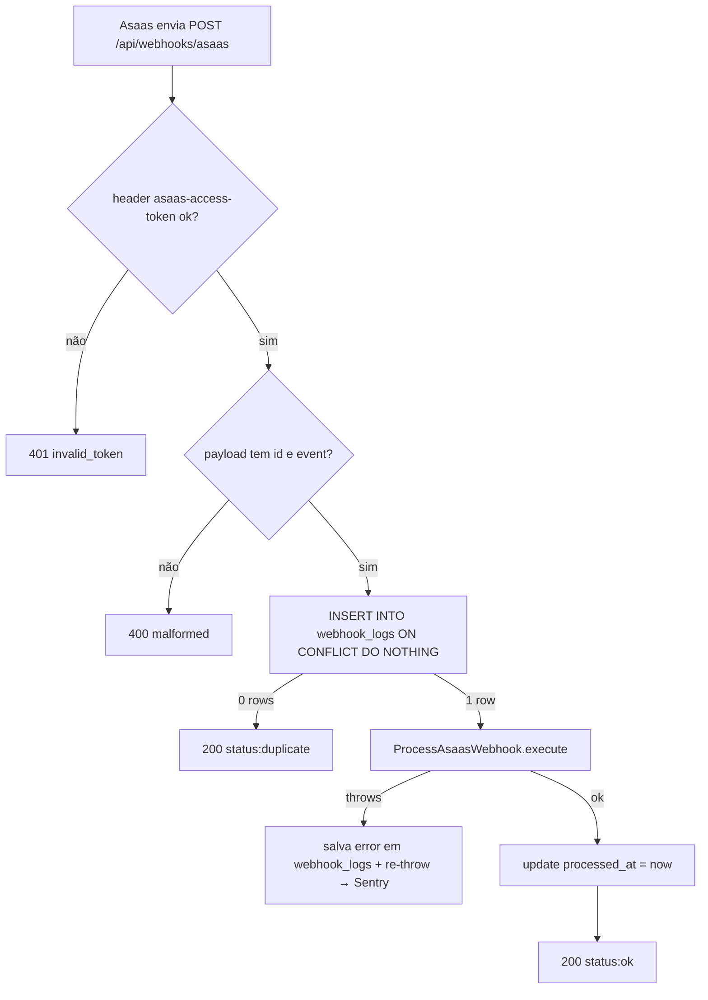

# Módulo Subscription

**Propósito:** plano Pro (R$ 25/mês via Asaas PIX) com assinatura recorrente. Free tem quota de 15 candidaturas/mês calendário; Pro é ilimitado. Cancelamento mantém Pro até o fim do período pago.

## Endpoints

| Método | Rota | Handler | Throttle / Auth |
|---|---|---|---|
| `GET` | `/api/me` | `AuthController@me` — passou a retornar envelope `{user, subscription}` | `auth:sanctum` |
| `GET` | `/api/me/quota` | `SubscriptionController@quota` — refresh leve só do contador | `auth:sanctum` |
| `POST` | `/api/subscriptions` | `SubscriptionController@store` → `SubscribeToPro` → 201 com PIX checkout | `auth:sanctum` + `throttle:subscribe-write` |
| `DELETE` | `/api/subscriptions` | `SubscriptionController@destroy` → `CancelSubscription` | `auth:sanctum` + `throttle:subscribe-write` |
| `POST` | `/api/webhooks/asaas` | `AsaasWebhookController@__invoke` | **público** + `throttle:asaas-webhook` |
| `GET` | `/api/pricing` | `PricingController@__invoke` — preços de free/pro pra landing | **público** |
| CLI | `php artisan subscriptions:downgrade-expired` | scheduler diário 01:00 UTC |

**Shape do envelope `{user, subscription}`** (login/register/verify/reset/me retornam o mesmo):
```json
{
  "user": { "id": 1, "name": "...", "email": "...", "locale": "pt_BR", "is_admin": false },
  "subscription": {
    "plan": "free" | "pro",
    "status": "active" | "canceled" | "past_due",
    "current_period_end": "ISO8601 | null",
    "canceled_at": "ISO8601 | null",
    "pro_price_cents": 2500,
    "quota": { "used": 7, "limit": 15 | null, "reset_at": "ISO8601", "plan": "free|pro" }
  }
}
```

**Shape de `/api/pricing`** (público — landing page lê daqui):
```json
{ "free": { "price_cents": 0 }, "pro": { "price_cents": 2500 } }
```

**Shape do PIX checkout** (`POST /api/subscriptions` em sucesso):
```json
{
  "pix_qr_code_base64": "iVBORw0KGgo=...",
  "pix_copy_paste": "00020126...",
  "due_date": "2026-05-21",
  "payment_id": "pay_xxx",
  "asaas_subscription_id": "sub_yyy"
}
```

**Erros mapeados:**
- Quota free atingida → **402** com `{ message, kind: 'quota_exceeded', used, limit, plan, reset_at }` (`QuotaExceededException`, raised dentro de `CreateApplication`).
- Já tem Pro ativo → **409** (`AlreadySubscribedException`).
- Free tentando cancelar → **422** (`NotSubscribedException`).
- Asaas timeout / 5xx / payload inválido → **502** (`AsaasClientException`).
- Webhook sem header `asaas-access-token` válido → **401**.
- Webhook sem `id` ou `event` no payload → **400**.

## Backend

**Controllers:**
- `backend/app/Http/Controllers/Api/SubscriptionController.php` — `quota`, `store`, `destroy`.
- `backend/app/Http/Controllers/Api/AsaasWebhookController.php` — `__invoke` único (header validation + idempotência via `webhook_logs` + delega pra `ProcessAsaasWebhook` action).

**Domínio:** `backend/app/Domain/Subscription/`
- **Contracts:** `AsaasGateway` (interface, mockável em testes).
- **Clients:** `AsaasHttpClient` (padrão `ViaCepClient` — `Http::baseUrl()->withHeaders(['access_token' => key])->timeout(15)`).
- **DTOs:** `SubscriptionData::fromUser()`, `QuotaData::fromUser()` (com const `FREE_MONTHLY_LIMIT = 15` + `TIMEZONE = 'America/Sao_Paulo'`), `CreateAsaasSubscriptionResult` (carrega `pixQrCodeBase64`, `pixCopyPaste`, `dueDate`, `paymentId`, `asaasSubscriptionId`, `asaasCustomerId`).
- **Actions:**
  - `SubscribeToPro::execute(User)` — cria customer no Asaas (ou reusa `asaas_customer_id` em re-assinatura), cria subscription PIX (`value=2500 cents`, `cycle=MONTHLY`, `nextDueDate=tomorrow`), pega QR do primeiro payment, persiste IDs **mas mantém plan=free** (webhook ativa Pro).
  - `CancelSubscription::execute(User)` — chama Asaas DELETE, marca `status=canceled` + `canceled_at=now()`. Mantém `plan='pro'` e `current_period_end` intactos.
  - `ProcessAsaasWebhook::execute(array $payload)` — switch por `event`: PAYMENT_CONFIRMED/RECEIVED → ativa Pro + estende `current_period_end` em +1 mês; PAYMENT_OVERDUE → `status=past_due` (plan intacto); SUBSCRIPTION_DELETED → `status=canceled` (plan intacto); demais → no-op.
  - `DowngradeExpiredSubscriptions::execute()` — `plan='pro' AND status IN ('canceled','past_due') AND current_period_end < now()` → vira free, zera `asaas_subscription_id` (mantém `asaas_customer_id` pra reuso).

**Exceptions** (`app/Domain/Subscription/Exceptions/`):
- `QuotaExceededException` (`DomainException`) com `int $used, $limit, string $resetAt, $plan`. Mensagem traduzida via `__('subscription.errors.quota_exceeded')`.
- `AlreadySubscribedException`, `NotSubscribedException` (mesmo padrão).
- `AsaasClientException` (`RuntimeException` — separa falha técnica de regra de negócio; capturada pra 502).

**Events** (`app/Events/`, auto-discovery): `SubscriptionActivated`, `SubscriptionDowngraded`, `SubscriptionPastDue`. Padrão `final class X { use Dispatchable; public function __construct(public readonly Subscription $subscription) {} }`.

**Command:** `app/Console/Commands/DowngradeExpiredSubscriptionsCommand.php` (signature `subscriptions:downgrade-expired`).

**Models:**
- `app/Models/Subscription.php` — `belongsTo(User)`, métodos `isPro(): bool` (defesa em profundidade: `plan='pro' && (current_period_end null || future)`) e `effectivePlan(): string` (retorna `'free'` se Pro mas vencido).
- `app/Models/User.php` — `hasOne(Subscription)`, hook `static::booted()` que faz `firstOrCreate` de uma sub `free/active` no evento `created` (todo user novo já nasce com subscription). Helper `isPro(): bool` delega no `subscription->isPro()`.

**Factory:** `database/factories/SubscriptionFactory.php` com states `pro()` / `proCanceled()` / `proExpired()`. **Não use em testes via `Subscription::factory()->create()`** — o hook do User já cria a free; conflita com UNIQUE. Use `$user->subscription()->update([...])` ou o helper `TestCase::makeProUser()`.

**Quota enforcement** — fica dentro de `CreateApplication::execute()` (`backend/app/Domain/Application/Actions/CreateApplication.php`), método privado `enforceQuota()` chamado **antes** do `Application::create`:
```php
$user->loadMissing('subscription');
if (! $user->isPro()) {
    $used = $user->applications()->where('applied_at', '>=', QuotaData::monthStart())->count();
    if ($used >= QuotaData::FREE_MONTHLY_LIMIT) {
        throw new QuotaExceededException(...);
    }
}
```
`ApplicationController@store` captura e mapeia pra 402 (mesmo padrão de `DuplicateApplicationException`→409 já existente).

**Rate limiters** (em `AppServiceProvider::configureRateLimiters()`):
- `subscribe-write`: 10/min user, 3/min IP (burst protection no subscribe/cancel).
- `asaas-webhook`: 120/min por IP (público, sem auth).

**Config:** `config/services.php` bloco `asaas` (`api_key`, `base_url`, `webhook_token`, `pro_value_cents`). Binding `AsaasGateway → AsaasHttpClient` em `AppServiceProvider::register()`.

**i18n:** `backend/lang/{pt_BR,en,es}/subscription.php` — mensagens das 4 exceptions.

### Webhook flow + idempotência



`webhook_logs.event_id` é PRIMARY KEY → `insertOrIgnore` é atomic. Replay do Asaas (mesma `event_id`) sempre retorna 200 sem reprocessar. Processamento **síncrono em fase 1** (volume baixo previsto, <100/dia).

### Mês calendário (quota reset)

Hardcoded `America/Sao_Paulo` em `QuotaData::monthStart()`. `config('app.timezone')` é `UTC` (pra logs/scheduler), mas quota é regra de produto BR → "dia 1º" precisa bater com expectativa do usuário. `now()->setTimezone('America/Sao_Paulo')->startOfMonth()->utc()` faz o cálculo.

### Ativação NÃO-otimista

`SubscribeToPro` **não** vira Pro imediato após chamar o Asaas. Só salva `asaas_subscription_id` no DB com `plan='free'` ainda. Webhook `PAYMENT_CONFIRMED` é a **única** fonte da verdade pra ativação — evita "Pro de graça" se usuário não pagar o PIX.

### CPF/CNPJ obrigatório

Asaas exige `cpfCnpj` no customer pra gerar cobrança PIX. Sem ele, `createSubscription` retorna 400 "O CPF/CNPJ do cliente é obrigatório...".

Fluxo:
1. Frontend mostra `CpfPromptModal` ao clicar "Assinar agora" — input com **máscara dinâmica** (CPF `000.000.000-00` ou CNPJ `00.000.000/0000-00`)
2. Validação client: 11 ou 14 dígitos (após strip de máscara)
3. Body do POST `/api/subscriptions` traz `cpf` (com ou sem máscara — backend normaliza)
4. `StoreSubscriptionRequest::normalizedCpf()` retorna só dígitos; aborta 422 se ≠ 11/14
5. `SubscribeToPro::execute(User, string $cpfCnpj)`:
   - Se `asaas_customer_id` é null: cria customer com CPF (`createCustomer(name, email, cpf)`)
   - Se existe e CPF mudou: chama `updateCustomerCpfCnpj($id, $newCpf)` (Asaas: `POST /customers/{id}`)
   - Persiste CPF no `subscriptions.cpf` pra reuso (re-assinatura não pede de novo)

Cobre o caso legacy de customer criado antes dessa validação (sem CPF): no momento da re-assinatura, atualiza o customer no Asaas com o CPF informado.

### Tabela `plans` (preço configurável via DB)

Preços ficam em `plans (id, slug UNIQUE, name, price_cents, active)`. Seed inicial: `free=0`, `pro=2500`. Mudar valor do Pro sem rebuild/restart:

```sql
UPDATE plans SET price_cents = 3990 WHERE slug = 'pro';
```

Ou via tinker (invalida cache automaticamente pelo `saved` hook):
```php
\App\Models\Plan::where('slug', 'pro')->update(['price_cents' => 3990]);
```

`Plan::priceCentsBySlug(string $slug): ?int` cacheia **apenas o int** (não o model Eloquent) por **60 segundos**.
**Por que int e não model?** Cachear model Eloquent vira `__PHP_Incomplete_Class` em alguns cenários de autoload/opcache + cookie de sessão antiga. Int é seguro.

Cache key: `plans.{slug}.price_cents`. Invalidado pelos hooks `static::saved`/`static::deleted` quando se usa Eloquent — UPDATE via SQL direto respeita o TTL de 60s, ou força com `php artisan cache:forget plans.pro.price_cents`.

Há também `Plan::findBySlug()` sem cache pra quando precisar do model completo (name/active). Pra **preço**, sempre `priceCentsBySlug`.

`SubscribeToPro`, `SubscriptionData::fromUser` e `PricingController` usam `priceCentsBySlug`. Frontend formata via `Intl.NumberFormat('pt-BR', { style: 'currency', currency: 'BRL' })` (helper em `src/shared/format/currency.ts:formatBrl`).

**Fallback** caso a migration ainda não tenha rodado (dev desatualizado): env `ASAAS_PRO_VALUE_CENTS` (default 2500) é usada. Em prod, a migration sempre roda no deploy → fallback nunca exercitado.

### Tabela `plans` (preço configurável via DB)

Preços ficam em `plans (slug, name, price_cents, active)`. Seed inicial: `free=0`, `pro=2500`. Para **mudar o valor do Pro sem rebuild/restart**:

```sql
UPDATE plans SET price_cents = 3990 WHERE slug = 'pro';
```

Ou via tinker:
```php
\App\Models\Plan::where('slug', 'pro')->update(['price_cents' => 3990]);
```

`Plan::priceCentsBySlug()` cacheia **apenas o int** (não o model Eloquent) por **60 segundos**. Cachear o model inteiro foi descartado: tem known issue de virar `__PHP_Incomplete_Class` na deserialização em alguns cenários de autoload/opcache. Int é seguro.

Cache é invalidado automaticamente por `static::saved`/`static::deleted` hooks no model — UPDATE via Eloquent reflete imediato; UPDATE direto via SQL respeita o TTL. Pra forçar imediato após SQL: `php artisan cache:forget plans.pro.price_cents`.

`SubscribeToPro`, `SubscriptionData::fromUser` e `PricingController` usam `Plan::priceCentsBySlug($slug)`. Há também um `Plan::findBySlug()` sem cache pra casos que precisam do model completo (nome/active) — não use pra preço.

**Fallback** caso a migration ainda não tenha rodado (dev local desatualizado): a env `ASAAS_PRO_VALUE_CENTS` (default 2500) é usada. Em prod, a migration sempre roda no deploy → fallback nunca é exercitado.

## Frontend

**Arquivos:** `frontend/src/modules/subscription/`

- **`composables/useSubscription.ts`** — `computed(() => useAuthStore().subscription)`. Reativo via auth store.
- **`composables/useQuota.ts`** — `useQuery(['subscription', 'quota'], GET /api/me/quota)`, `staleTime: 30s`. Usar pra refresh leve do contador depois de criar/cancelar app sem refazer `/api/me`.
- **`composables/useSubscribeToPro.ts`** — `useMutation` POST `/api/subscriptions`. Catch tipa erro como `kind: 'already' | 'gateway' | 'validation' | 'unknown'`.
- **`composables/useCancelSubscription.ts`** — `useMutation` DELETE `/api/subscriptions`. `onSuccess` chama `auth.fetchMe()` pra atualizar store.

- **`views/PlanView.vue`** (`/app/plan`) — 3 cards:
  - **Plano atual**: badge PRO/FREE + status + (se Pro) botão "Cancelar assinatura" (abre dialog de confirmação inline).
  - **Uso este mês**: progress bar com `used/limit` colorida (brand <80%, amber 80-99%, red 100%) ou "Ilimitado" se Pro. Reset date.
  - **Upgrade Pro** (visível se não-Pro): título + R$ 25/mês + benefícios com checkmark verde + CTA "Assinar agora" que abre `PixCheckoutModal`.
- **`components/PixCheckoutModal.vue`** — recebe `PixCheckout` via prop. Renderiza QR (``), botão "Copiar código PIX" via `navigator.clipboard.writeText()` com feedback "Copiado!", polling `auth.fetchMe()` a cada 5s. Quando `subscription.plan === 'pro' && status === 'active'` emit `activated` e fecha. Timeout 5min mostra mensagem fallback.
- **`components/UpgradeModal.vue`** — disparado em `kind: 'quota_exceeded'` no `useApplyToJob`. CTA "Assinar Pro — R$ 25/mês" faz `router.push('plan')`; CTA secundária "Aguardar virada do mês".

**Auth store:**
- `frontend/src/modules/auth/stores/auth.ts` — state ganhou `subscription: Subscription | null`. Helper privado `parseEnvelope()` centraliza o parse de `{user, subscription}` — usado em `fetchMe`, `login`, `register`, `verifyEmail`, `resetPassword`. Logout reseta `subscription = null`.

**Schemas Zod** (`frontend/src/shared/api/schemas.ts`): `PlanSchema`, `SubscriptionStatusSchema`, `QuotaSchema`, `SubscriptionSchema`, `PixCheckoutSchema`, `AuthEnvelopeSchema`.

**Integration points:**
- **`useApplyToJob`** — `ApplyError` union estendido com `{ kind: 'quota_exceeded', used, limit, resetAt, plan }`. 402 mapeado antes do 422 genérico.
- **`JobsListView`** — captura `quota_exceeded` no catch do `onApply` e abre `UpgradeModal`.
- **`AppLayout`** (desktop + mobile dropdowns) — novo item "Plano" entre Perfil e Sair. Badge "PRO" emerald se `auth.subscription?.plan === 'pro'`.
- **`LandingView`** — seção pricing virou grid 2 colunas (Free vs Pro). Pro destacado com `ring-2 ring-brand-400 shadow-glow` + badge "Mais popular". Eyebrow do hero mudou de "100% gratuito" pra "Comece grátis. Cresça quando quiser." Stats label virou "A partir de" (mantém R$ 0).

## Efeitos colaterais

- Escritas: `subscriptions` (1 linha por user — UNIQUE em `user_id`), `webhook_logs` (idempotência).
- Migrations:
  - `2026_05_19_010000_create_subscriptions_table` — colunas `plan, status, asaas_customer_id, asaas_subscription_id, current_period_start, current_period_end, canceled_at, last_payment_at, last_payment_id` + 3 índices (`asaas_customer_id`, `current_period_end`, `plan+status`).
  - `2026_05_19_010100_create_webhook_logs_table` — `event_id` (string PK), `source, event_type, payload (json), processed_at, error, created_at`.
  - `2026_05_19_010200_backfill_free_subscriptions` — `INSERT INTO subscriptions SELECT id, 'free', 'active' FROM users ON CONFLICT DO NOTHING` (cobre users existentes; novos users são cobertos pelo `User::booted()` hook).
  - `2026_05_19_010300_add_user_applied_index_to_applications` — índice composto `(user_id, applied_at)` pra otimizar query da quota.
- Eventos: `SubscriptionActivated` (no PAYMENT_CONFIRMED), `SubscriptionDowngraded` (no command), `SubscriptionPastDue` (no PAYMENT_OVERDUE).
- Chamadas externas: Asaas API (`/customers`, `/subscriptions`, `/payments/{id}/pixQrCode`, `DELETE /subscriptions/{id}`).
- Scheduler: `subscriptions:downgrade-expired` daily 01:00 UTC.

## Testes

- `backend/tests/Unit/Domain/Subscription/`
  - `SubscriptionModelTest` — 5 testes (boundary cases `isPro`/`effectivePlan`).
  - `AsaasHttpClientTest` — 11 testes com `Http::fake()` (cada método + edge cases: empty response, 5xx, 404 idempotente).
- `backend/tests/Feature/Subscription/`
  - `SubscribeToProTest` — 5: happy path com mock `AsaasGateway`, reuso de `asaas_customer_id`, 409 já Pro, 502 gateway falha, auth.
  - `CancelSubscriptionTest` — 3: Pro→canceled mantém plan/period, free→422, auth.
  - `AsaasWebhookTest` — 9: header inválido/ausente, sem id/event, PAYMENT_CONFIRMED+RECEIVED, OVERDUE, SUBSCRIPTION_DELETED, replay idempotente, evento desconhecido.
  - `DowngradeExpiredCommandTest` — 5: canceled+vencido, past_due+vencido, active+vencido (não degrada), canceled+futuro (não degrada), free (ignora).
- `backend/tests/Feature/Applications/QuotaEnforcementTest` — 4: free 14→201, free 15→402 com body completo, Pro 50→201, mês anterior não conta.
- `backend/tests/Feature/Auth/MeTest` — atualizado pra assertar envelope completo `{user, subscription, quota}`.
- `frontend/tests/useSubscribeToPro.test.ts` — 4: parse PIX, 409→`already`, 502→`gateway`, network→`unknown`.
- `frontend/tests/useQuota.test.ts` — 2: parse free (limit=15), parse Pro (limit=null).
- `frontend/tests/useApplyToJob.test.ts` — caso novo cobrindo 402 → `kind: 'quota_exceeded'`.

**Helper:** `Tests\TestCase::makeProUser(?User $user = null): User` cria/usa user, atualiza sua subscription pra Pro ativa (com IDs `cus_test_*` / `sub_test_*` + `current_period_end = now()+1mo`).

## Pontos de atenção

- **`User::booted()` cria subscription free automaticamente.** Em tests, **não** chame `Subscription::factory()->create()` pra users que já existem — UNIQUE em `user_id` quebra. Use `$user->subscription()->update([...])` ou `makeProUser()`.
- **Ativação Pro só via webhook.** `SubscribeToPro` salva os IDs do Asaas mas mantém `plan='free'`. Se em testes você precisa Pro instantâneo, use `makeProUser()`, **não** o endpoint POST `/api/subscriptions`.
- **Timezone da quota.** `QuotaData::monthStart()` força `America/Sao_Paulo` (hardcoded). `config('app.timezone')` é `UTC`. Se mover users pra outro fuso no futuro, refatorar pra timezone do user (atributo no profile).
- **402 vs 429.** Quota é **402 Payment Required** (regra de produto, paga pra remover). Não confundir com 429 Too Many Requests (rate-limit técnico do throttle).
- **Webhook idempotente por `event_id`.** Se Asaas reentregar, sempre retornamos 200 sem reprocessar. Não confiar em "chegou 1x = chegou 1x" — `webhook_logs.event_id` é PK.
- **`asaas_customer_id` é preservado em downgrades.** O command `DowngradeExpiredSubscriptions` zera `asaas_subscription_id` mas mantém `asaas_customer_id`. Re-assinatura reusa o customer (não cria duplicado no Asaas).
- **`effectivePlan()` é defesa em profundidade.** Se o scheduler atrasar e DB diz `plan='pro'` mas `current_period_end < now()`, `effectivePlan()` retorna `'free'`. `User::isPro()` usa `Subscription::isPro()` que faz a mesma verificação — segura UI e quota check.
- **Pro mantém intacto durante period_end mesmo com `status=canceled` ou `past_due`.** Cancelou dia 10, pagou até dia 30 → fica Pro até dia 30. Só o command de downgrade derruba (e só roda depois do period_end).
- **Asaas 404 no cancel é idempotente.** Se a sub já foi removida no painel Asaas, `AsaasHttpClient::cancelSubscription` ignora silenciosamente. Defensive — evita erro em re-tentativas.
- **Header `asaas-access-token` é validado com `hash_equals`.** Timing-safe contra side-channel.
- **Stateful API + webhook.** `EnsureFrontendRequestsAreStateful` só vira stateful se Referer bate domínio Sanctum. Webhook do Asaas vem de IP externo sem Referer → tratado como stateless → sem CSRF. Não mexa nessa cadeia.
- **Free user com 20+ apps em meses anteriores.** Não bloqueia candidaturas no mês atual (query filtra por `applied_at >= startOfMonth`). Se virar Pro→Free no meio do mês, conta só o que foi feito após virar.
- **Env vars obrigatórias** (em `infra/secrets/backend.env`):
  - `ASAAS_API_KEY` — sandbox ou prod
  - `ASAAS_BASE_URL` — `https://sandbox.asaas.com/api/v3` ou `https://api.asaas.com/v3`
  - `ASAAS_WEBHOOK_TOKEN` — secret compartilhado com painel Asaas (config no painel: webhook URL + header `asaas-access-token`)
  - `ASAAS_PRO_VALUE_CENTS` — default 2500 (R$ 25,00)
- **Polling do `PixCheckoutModal`.** A cada 5s chama `auth.fetchMe()`. Timeout 5min mostra mensagem fallback "Já pagou e ainda não ativou? Recarregue depois de pagar". Sem WebSocket — volume baixo + PIX confirma em 2-30s não justifica complexidade adicional.
- **Race de quota.** 2 abas criando candidatura simultânea podem ultrapassar limite em 1-2 itens (query `count` + insert sem lock). Aceito em fase 1 — corner case e overshoot mínimo.
- **`DeleteAccount` (Phase 5 pendente).** Hoje deleta o user mas `subscriptions` cai por cascade. Asaas continua cobrando. Solução: `DeleteAccount` chamar `CancelSubscription` best-effort antes de deletar. Documentar no LGPD export se não for automático.
